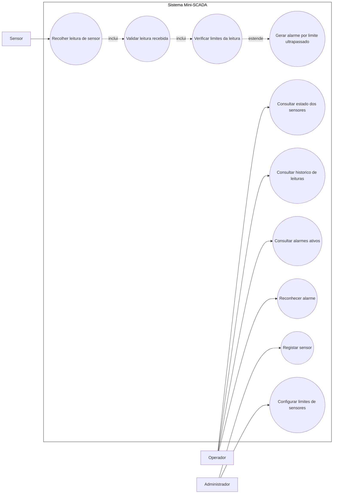

```mermaid
flowchart LR
    Sensor[Sensor]
    Operador[Operador]
    Admin[Administrador]

    subgraph Sistema [Sistema Mini-SCADA]
        direction TB
        CU01((Recolher leitura de sensor))
        CU02((Validar leitura recebida))
        CU03((Verificar limites da leitura))
        CU04((Gerar alarme por limite ultrapassado))
        CU05((Consultar alarmes ativos))
        CU06((Reconhecer alarme))
        CU07((Consultar historico de leituras))
        CU08((Configurar limites de sensores))
        CU09((Consultar estado dos sensores))
        CU10((Registar sensor))

        CU01 -. inclui .-> CU02
        CU02 -. inclui .-> CU03
        CU03 -. estende .-> CU04
    end

    Sensor --> CU01

    Operador --> CU09
    Operador --> CU07
    Operador --> CU05
    Operador --> CU06

    Admin --> CU10
    Admin --> CU08

    style Sistema fill:transparent,stroke:#888888,stroke-width:2px,color:#000000
```
