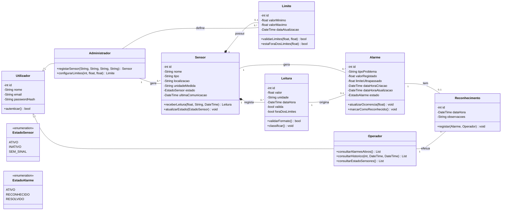

```mermaid
classDiagram
    direction LR

    class Utilizador {
        -int id
        -String nome
        -String email
        -String passwordHash
        +autenticar() bool
    }

    class Operador {
        +consultarAlarmesAtivos() List
        +consultarHistorico(int, DateTime, DateTime) List
        +consultarEstadoSensores() List
    }

    class Administrador {
        +registarSensor(String, String, String, String) Sensor
        +configurarLimites(int, float, float) Limite
    }

    class Sensor {
        -int id
        -String nome
        -String tipo
        -String localizacao
        -String unidadeMedida
        -EstadoSensor estado
        -DateTime ultimaComunicacao
        +receberLeitura(float, String, DateTime) Leitura
        +atualizarEstado(EstadoSensor) void
    }

    class Limite {
        -int id
        -float valorMinimo
        -float valorMaximo
        -DateTime dataAtualizacao
        +validarLimites(float, float) bool
        +estaForaDosLimites(float) bool
    }

    class Leitura {
        -int id
        -float valor
        -String unidade
        -DateTime dataHora
        -bool valida
        -bool foraDosLimites
        +validarFormato() bool
        +classificar() void
    }

    class Alarme {
        -int id
        -String tipoProblema
        -float valorRegistado
        -float limiteUltrapassado
        -DateTime dataHoraCriacao
        -DateTime dataHoraAtualizacao
        -EstadoAlarme estado
        +atualizarOcorrencia(float) void
        +marcarComoReconhecido() void
    }

    class Reconhecimento {
        -int id
        -DateTime dataHora
        -String observacoes
        +registar(Alarme, Operador) void
    }

    class EstadoSensor {
        <<enumeration>>
        ATIVO
        INATIVO
        SEM_SINAL
    }

    class EstadoAlarme {
        <<enumeration>>
        ATIVO
        RECONHECIDO
        RESOLVIDO
    }

    Utilizador <|-- Operador
    Utilizador <|-- Administrador
    Sensor "1" *-- "0..1" Limite : possui
    Sensor "1" *-- "0..*" Leitura : regista
    Sensor "1" -- "0..*" Alarme : gera
    Leitura "1" -- "0..1" Alarme : origina
    Alarme "1" -- "0..1" Reconhecimento : tem
    Operador "1" -- "0..*" Reconhecimento : efetua
    Administrador "1" -- "0..*" Sensor : gere
    Administrador "1" -- "0..*" Limite : define
```
