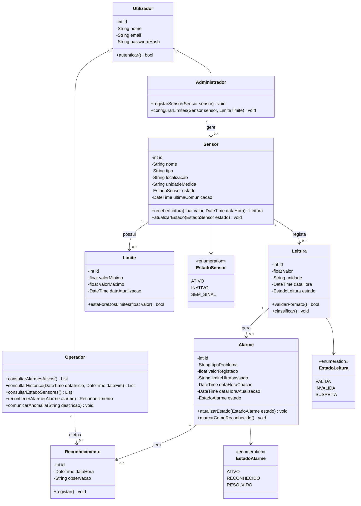

```mermaid
classDiagram

class Utilizador {
  -int id
  -String nome
  -String email
  -String passwordHash
  +autenticar() bool
}

class Administrador {
  +registarSensor(Sensor sensor) void
  +configurarLimites(Sensor sensor, Limite limite) void
}

class Operador {
  +consultarAlarmesAtivos() List
  +consultarHistorico(DateTime dataInicio, DateTime dataFim) List
  +consultarEstadoSensores() List
  +reconhecerAlarme(Alarme alarme) Reconhecimento
  +comunicarAnomalia(String descricao) void
}

class Sensor {
  -int id
  -String nome
  -String tipo
  -String localizacao
  -String unidadeMedida
  -EstadoSensor estado
  -DateTime ultimaComunicacao
  +receberLeitura(float valor, DateTime dataHora) Leitura
  +atualizarEstado(EstadoSensor estado) void
}

class Leitura {
  -int id
  -float valor
  -String unidade
  -DateTime dataHora
  -EstadoLeitura estado
  +validarFormato() bool
  +classificar() void
}

class Limite {
  -int id
  -float valorMinimo
  -float valorMaximo
  -DateTime dataAtualizacao
  +estaForaDosLimites(float valor) bool
}

class Alarme {
  -int id
  -String tipoProblema
  -float valorRegistado
  -String limiteUltrapassado
  -DateTime dataHoraCriacao
  -DateTime dataHoraAtualizacao
  -EstadoAlarme estado
  +atualizarEstado(EstadoAlarme estado) void
  +marcarComoReconhecido() void
}

class Reconhecimento {
  -int id
  -DateTime dataHora
  -String observacao
  +registar() void
}

class EstadoSensor {
  <<enumeration>>
  ATIVO
  INATIVO
  SEM_SINAL
}

class EstadoLeitura {
  <<enumeration>>
  VALIDA
  INVALIDA
  SUSPEITA
}

class EstadoAlarme {
  <<enumeration>>
  ATIVO
  RECONHECIDO
  RESOLVIDO
}

Utilizador <|-- Administrador
Utilizador <|-- Operador

Administrador "1" --> "0..*" Sensor : gere
Sensor "1" --> "0..*" Leitura : regista
Sensor "1" --> "0..*" Limite : possui
Leitura "1" --> "0..1" Alarme : gera

Alarme "1" --> "0..1" Reconhecimento : tem
Operador "1" --> "0..*" Reconhecimento : efetua

Sensor --> EstadoSensor
Leitura --> EstadoLeitura
Alarme --> EstadoAlarme
```
