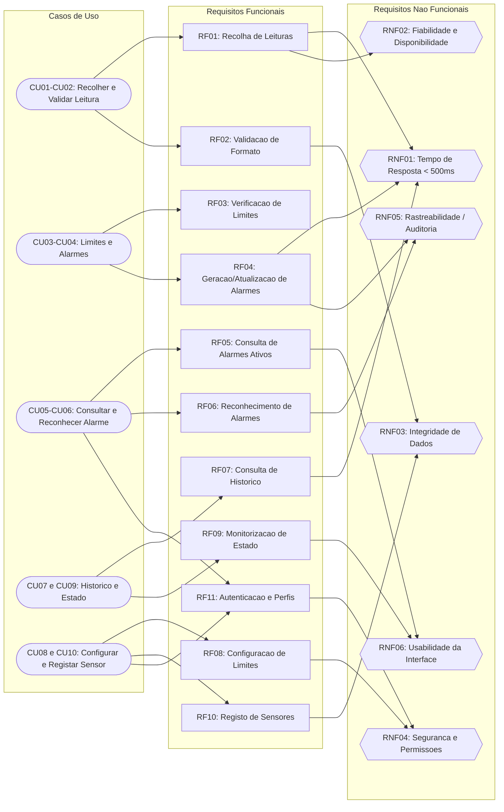

```mermaid
flowchart LR
    subgraph Atores_e_Casos_de_Uso [Casos de Uso]
        CU01_02([CU01-CU02: Recolher e Validar Leitura])
        CU03_04([CU03-CU04: Limites e Alarmes])
        CU05_06([CU05-CU06: Consultar e Reconhecer Alarme])
        CU07_09([CU07 e CU09: Historico e Estado])
        CU08_10([CU08 e CU10: Configurar e Registar Sensor])
    end

    subgraph Requisitos_Funcionais [Requisitos Funcionais]
        RF01[RF01: Recolha de Leituras]
        RF02[RF02: Validacao de Formato]
        RF03[RF03: Verificacao de Limites]
        RF04[RF04: Geracao/Atualizacao de Alarmes]
        RF05[RF05: Consulta de Alarmes Ativos]
        RF06[RF06: Reconhecimento de Alarmes]
        RF07[RF07: Consulta de Historico]
        RF08[RF08: Configuracao de Limites]
        RF09[RF09: Monitorizacao de Estado]
        RF10[RF10: Registo de Sensores]
        RF11[RF11: Autenticacao e Perfis]
    end

    subgraph Requisitos_Nao_Funcionais [Requisitos Nao Funcionais]
        RNF01{{RNF01: Tempo de Resposta < 500ms}}
        RNF02{{RNF02: Fiabilidade e Disponibilidade}}
        RNF03{{RNF03: Integridade de Dados}}
        RNF04{{RNF04: Seguranca e Permissoes}}
        RNF05{{RNF05: Rastreabilidade / Auditoria}}
        RNF06{{RNF06: Usabilidade da Interface}}
    end

    %% Ligacoes CU -> RF
    CU01_02 --> RF01
    CU01_02 --> RF02
    CU03_04 --> RF03
    CU03_04 --> RF04
    CU05_06 --> RF05
    CU05_06 --> RF06
    CU07_09 --> RF07
    CU07_09 --> RF09
    CU08_10 --> RF08
    CU08_10 --> RF10
    CU05_06 --> RF11
    CU08_10 --> RF11

    %% Ligacoes RF -> RNF
    RF01 --> RNF01
    RF01 --> RNF02
    RF02 --> RNF03
    RF04 --> RNF01
    RF04 --> RNF05
    RF06 --> RNF05
    RF07 --> RNF01
    RF08 --> RNF04
    RF10 --> RNF03
    RF11 --> RNF04
    RF05 --> RNF06
    RF09 --> RNF06
```
