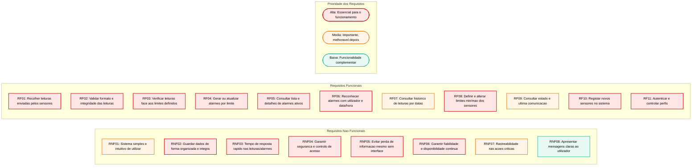

```mermaid
flowchart TB
    subgraph Legenda [Prioridade dos Requisitos]
        direction LR
        P_ALTA([Alta: Essencial para o funcionamento]):::alta
        P_MEDIA([Media: Importante, melhoravel depois]):::media
        P_BAIXA([Baixa: Funcionalidade complementar]):::baixa
    end

    subgraph RF [Requisitos Funcionais]
        direction TB
        RF01["RF01: Recolher leituras enviadas pelos sensores"]:::alta
        RF02["RF02: Validar formato e integridade das leituras"]:::alta
        RF03["RF03: Verificar leituras face aos limites definidos"]:::alta
        RF04["RF04: Gerar ou atualizar alarmes por limite"]:::alta
        RF05["RF05: Consultar lista e detalhes de alarmes ativos"]:::alta
        RF06["RF06: Reconhecer alarmes com utilizador e data/hora"]:::alta
        RF07["RF07: Consultar historico de leituras por datas"]:::media
        RF08["RF08: Definir e alterar limites min/max dos sensores"]:::alta
        RF09["RF09: Consultar estado e ultima comunicacao"]:::media
        RF10["RF10: Registar novos sensores no sistema"]:::alta
        RF11["RF11: Autenticar e controlar perfis"]:::alta
    end

    subgraph RNF [Requisitos Nao Funcionais]
        direction TB
        RNF01["RNF01: Sistema simples e intuitivo de utilizar"]:::media
        RNF02["RNF02: Guardar dados de forma organizada e integra"]:::alta
        RNF03["RNF03: Tempo de resposta rapido nas leituras/alarmes"]:::alta
        RNF04["RNF04: Garantir seguranca e controlo de acesso"]:::alta
        RNF05["RNF05: Evitar perda de informacao mesmo sem interface"]:::alta
        RNF06["RNF06: Garantir fiabilidade e disponibilidade continua"]:::alta
        RNF07["RNF07: Rastreabilidade nas acoes criticas"]:::media
        RNF08["RNF08: Apresentar mensagens claras ao utilizador"]:::baixa
    end

    Legenda ~~~ RF
    RF ~~~ RNF

    classDef alta fill:#ffe6e6,stroke:#cc0000,stroke-width:2px,color:#000
    classDef media fill:#fff4e6,stroke:#e67e22,stroke-width:2px,color:#000
    classDef baixa fill:#e8f8f5,stroke:#1abc9c,stroke-width:2px,color:#000
```

