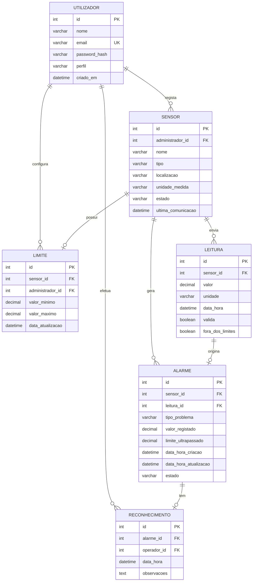

```mermaid
erDiagram
    UTILIZADOR {
        int id PK
        varchar nome
        varchar email UK
        varchar password_hash
        varchar perfil
        datetime criado_em
    }

    SENSOR {
        int id PK
        int administrador_id FK
        varchar nome
        varchar tipo
        varchar localizacao
        varchar unidade_medida
        varchar estado
        datetime ultima_comunicacao
    }

    LIMITE {
        int id PK
        int sensor_id FK
        int administrador_id FK
        decimal valor_minimo
        decimal valor_maximo
        datetime data_atualizacao
    }

    LEITURA {
        int id PK
        int sensor_id FK
        decimal valor
        varchar unidade
        datetime data_hora
        boolean valida
        boolean fora_dos_limites
    }

    ALARME {
        int id PK
        int sensor_id FK
        int leitura_id FK
        varchar tipo_problema
        decimal valor_registado
        decimal limite_ultrapassado
        datetime data_hora_criacao
        datetime data_hora_atualizacao
        varchar estado
    }

    RECONHECIMENTO {
        int id PK
        int alarme_id FK
        int operador_id FK
        datetime data_hora
        text observacoes
    }

    UTILIZADOR ||--o{ SENSOR : "regista"
    UTILIZADOR ||--o{ LIMITE : "configura"
    UTILIZADOR ||--o{ RECONHECIMENTO : "efetua"
    SENSOR ||--o| LIMITE : "possui"
    SENSOR ||--o{ LEITURA : "envia"
    SENSOR ||--o{ ALARME : "gera"
    LEITURA ||--o| ALARME : "origina"
    ALARME ||--o| RECONHECIMENTO : "tem"
```
